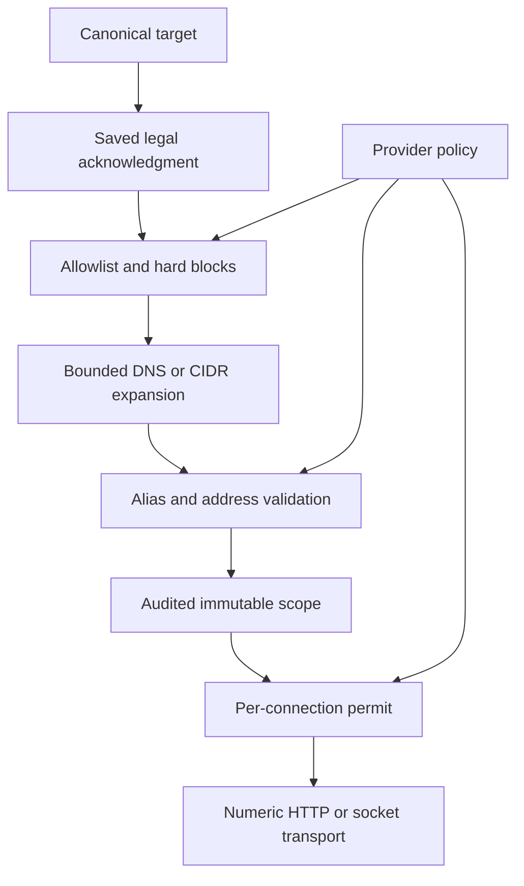
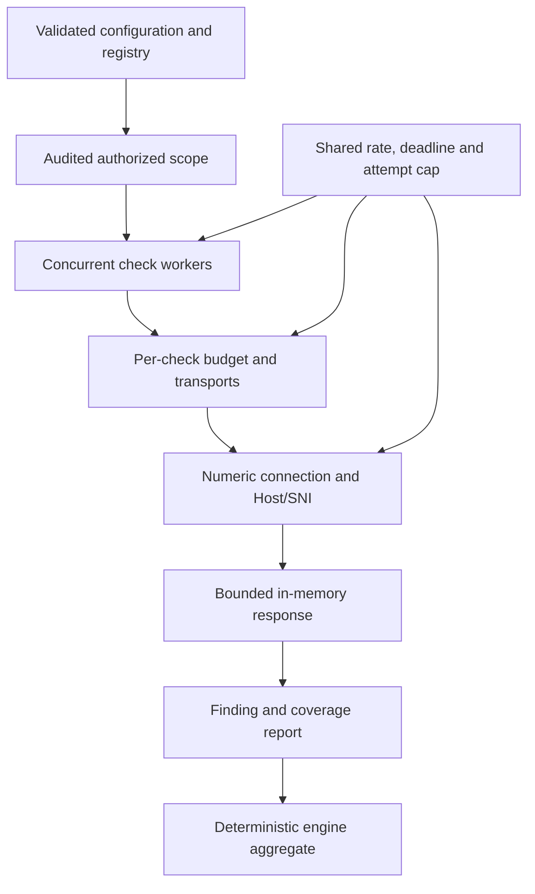
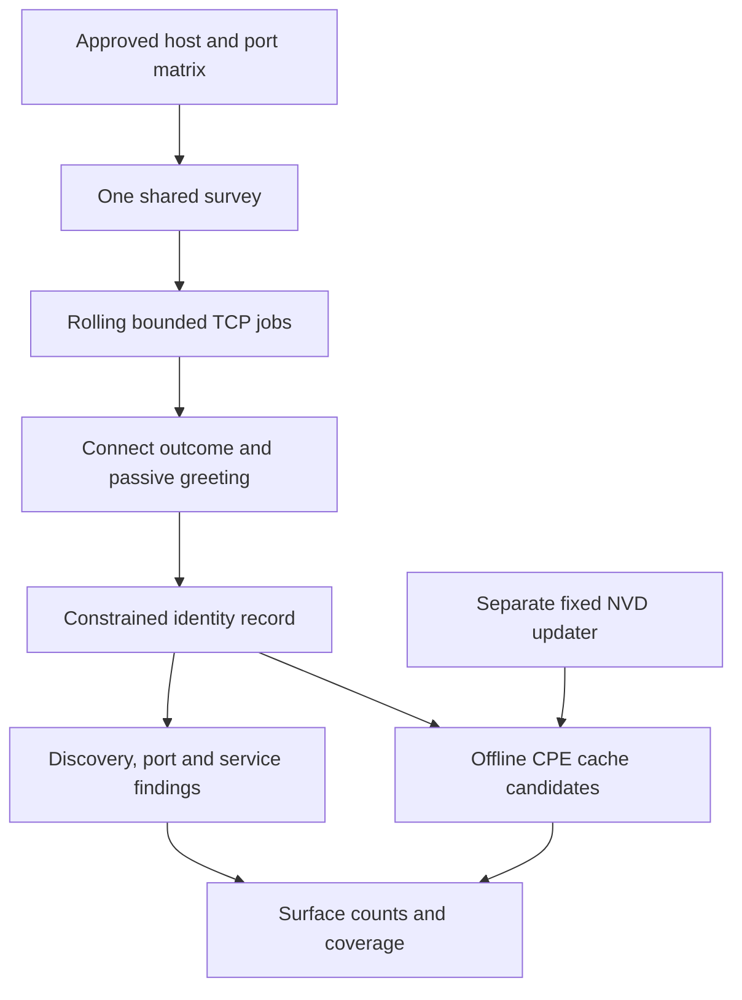

# Scanner architecture

The safety foundation separates **authorization**, **connection permission** and
**finding evidence**. Version 0.6.0 exposes the completed engine through one full CLI, private offline reports and a non-root container. The shared passive network survey, catalog candidates and ten bounded web checks retain the same authorization and transport boundaries.

## Models

| Model | Purpose |
| --- | --- |
| `Target` | Canonical syntax and audit-safe target identity. |
| `Resolution` | Numeric addresses plus canonical/alias names from a bounded lookup. |
| `AuthorizedScope` | UUID, immutable target addresses, approved ports and allowed origins. |
| `EndpointPermit` | Addresses to connect to and the hostname needed for Host/SNI. |
| `Evidence` | Bounded observations with method, endpoint and optional response status. |
| `Finding` | Issue identity, certainty, severity, remediation and optional CVSS. |
| `CheckOutcome` | Complete, failed, inconclusive or skipped coverage with reasons. |
| `ScanResult` | Engine-owned aggregate with timestamps, findings and coverage. |

## Check registration

`CheckRegistry.register(CheckInfo(...))` is a decorator for concrete `BaseCheck`
subclasses. Classes receive immutable metadata. Imports only register checks;
they do not execute requests. Registry construction finishes before workers
start. Tests use independent registries to avoid global-state pollution.

`CheckContext` provides explicitly typed transports, scope, budgets and
configuration. Checks must use those transports rather than importing unrestricted
HTTP clients or connecting directly. Registry selection validates names, modes
and duplicates before any work begins.

## Authorization flow

1. Parse the target without making network calls.
2. Require the saved legal acknowledgment before resolving any name.
3. Reject government/military labels and unapproved named targets.
4. Resolve A and AAAA under one deadline, preserving CNAME/DNAME information.
5. Reject the entire answer if any alias/address is prohibited.
6. Validate each address against exact local rules, allowlists and provider policy.
7. Select immutable origins and ports and append an audit event.
8. Return a scope only after audit persistence succeeds.

For CIDRs, the total-address budget is checked before expansion. Network and
broadcast addresses are omitted according to `ipaddress.hosts()` semantics.
Public network checks cannot use a single allowlisted network-address entry
to authorize a larger network.

## Implemented transport contract

- Obtain an `EndpointPermit` immediately before connecting.
- Connect to one of its **numeric addresses**, never resolve its hostname again.
- Preserve the original hostname for HTTP Host and TLS server-name verification.
- Inspect redirect destinations before following them and validate their permits.
- Use isolated single-exchange pools without cookies or implicit proxies, cap response bytes,
  and close streamed responses and absolute-deadline timers promptly.
- Use one global limiter for scan operations, including retries and TLS probes.
- Keep per-check failures and coverage explicit in the aggregate result.

Pinning is what defeats a changing DNS answer. The permit still checks current
policy freshness and hard blocks, but does not resolve a hostname again.

## Evidence and scoring

Minimal observations are constructed by checks. The evidence sanitizer is only
a secondary safeguard; unknown secret formats cannot be reliably detected by regex.
Audit target identities omit URL paths and query values entirely.

CVSS31 implements FIRST's base metrics and integer roundup procedure. It rejects
unknown/duplicate/missing metrics and computes the score from the vector. Severity
remains the report's context-sensitive assessment; confidence records the quality
of the evidence. Unverified signals may omit CVSS rather than guessing impact.

## Storage and deployment

Authorization state is local to the operator's account. The snapshot and source
code are trusted local inputs. There is no database, HTTP server, remote telemetry,
analytics or target-data cache in this foundation. See [transport API](TRANSPORTS.md)
for per-check/scan budgets and failure isolation. The installed `vulnscan` CLI preflights settings and report destinations before
acknowledgment/scope resolution. Docker wraps that same entry point; it does not
introduce another scan path. See [CLI](CLI.md) and [deployment](DEPLOYMENT.md).

## Engine data flow

Selection, trust-file validation and runtime permission checks precede target
service traffic. Workers have separate HTTP pools and coverage ledgers; the
controller provides shared pacing and atomic attempt limits. The aggregator
records incomplete checks even when another check fails.

## Built-in web modules

`load_web_checks()` explicitly imports ten known decorated classes. Every rule
uses `WebCheck` to preserve observations on expected transport/scope failures,
`WebRecord` for minimal evidence and the existing bounded transports. Shared
helpers parse HTML metadata without executing it and cap query mutations.
Trusted packaged wordlists are capped and validated. No module import scans.

Only `TCPTransport.probe_tls()` constructs fixed unverified diagnostic contexts;
it exposes metadata, never a socket or application-data send API. HTTP always
uses its separate verified context. Public canary values and local CA paths are
excluded from serialized operational settings. The web runner emits the existing
result schema. The report-only CLI validates that result and renders offline reports;
it never reauthorizes the scope or executes another scan.

## Shared network data flow

Each pair consumes one connection under the global controller. Checks await one
immutable result rather than duplicating traffic. Raw bytes never enter shared
records. Network mode explicitly enumerates approved numeric DNS answers and
refuses matrices larger than its operation budget before target-service work.
The publisher updater is a separate opt-in command, not a scan-side callback.
Source-tree and standard wheel installs resolve the same bounded trusted resources.

## CLI and deployment responsibilities

| Module / file | Responsibility |
| --- | --- |
| `scanner/cli.py` | Parses bounded commands, chooses built-ins, loads configuration/scope, invokes the engine and publishes reports. |
| `scanner/utils/logger.py` | Configures literal scanner-only logging without Requests/root tracebacks. |
| `cli.py` | Source-checkout entry point; same behavior as the installed command. |
| `Dockerfile` | Builds runtime wheels and runs UID10001 without development/test tooling. |
| `docker-compose.yml` | Persists private state/reports, mounts read-only policy settings and offers an isolated opt-in lab. |
| `.github/workflows/ci.yml` | Defines lint/test/build/wheel and separate container smoke validation after publication. |

The offline exporter can prepare three formats plus a native result in one
new-only private publication. Invalid destinations fail before target traffic;
publication still uses an atomic new-file link per path with best-effort rollback,
not a filesystem-wide transaction. CLI coverage codes do not encode a business
risk threshold. Remote CI and container runtime claims require actual execution.
